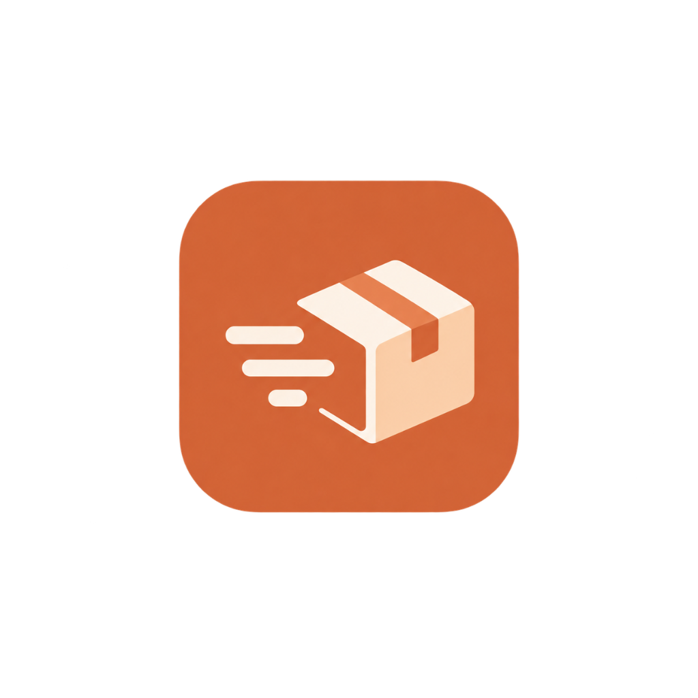
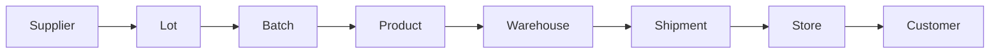
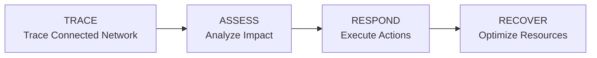
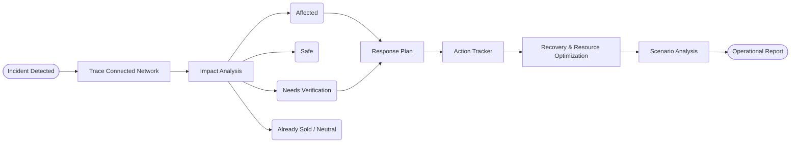
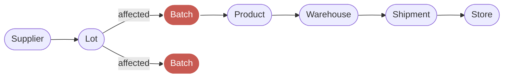
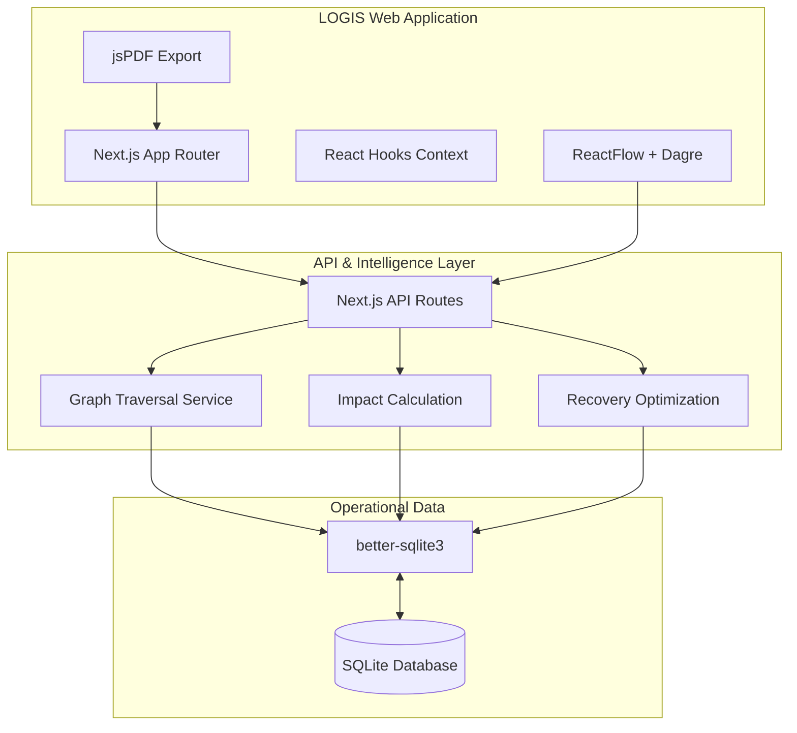

<div align="center">
  
  <h1>LOGIS</h1>
  <p><strong>Incident Intelligence & Operational Recovery</strong></p>
  <p><em>Trace the impact. Act on what matters. Recover faster.</em></p>

  <p>
    
    
    
    
  </p>
</div>

---

## What is LOGIS?

**LOGIS** is an incident intelligence and operational recovery platform designed to help businesses understand the impact of operational incidents, identify affected and safe parts of a connected supply chain, coordinate response actions, and recover disrupted resources.

It acts as a decision and intelligence layer over operational data, allowing teams to quickly isolate supply chain disruptions without unnecessarily halting unaffected operations. 

> **Note:** LOGIS is an intelligence layer and does not replace your ERP, WMS, TMS, or regulatory traceability systems.

---

## The Problem

When a disruption (like a contamination or defect) occurs, operations teams need to immediately determine the exact scope of the impact across the connected supply chain network:



When an incident happens, teams need to quickly determine:
- What is affected?
- What is safe?
- What needs verification?
- Where is the affected inventory?
- Which shipments should stop?
- Which facilities need action?
- What should happen first?
- How can the business recover?

### Real Incident Example

Imagine a problematic ingredient lot enters production. That single lot can flow into multiple batches, products, warehouses, shipments, and stores. A broad, naive response might recall or halt much more inventory than necessary, incurring massive costs.

LOGIS focuses on tracing the connected operational network and helping teams identify the *relevant* scope of the response, so safe products continue moving and disrupted resources are recovered efficiently.

*(Note: Demonstration data shown in LOGIS may be synthetic/simulated.)*

---

## The LOGIS Approach

Our core workflow helps businesses regain control over disruptions:

**TRACE → ASSESS → RESPOND → RECOVER**

- 🔍 **TRACE:** Understand how an incident moves through the operational network.
- ⚖️ **ASSESS:** Separate affected, safe, uncertain, and already-sold/neutral inventory.
- 🎯 **RESPOND:** Turn impact analysis into targeted operational actions.
- ♻️ **RECOVER:** Use available capacity and resources to reduce disruption.

### Main Workflow Diagram



### Incident-to-Action Flow



---

## Core Features

| Feature | Description |
| :--- | :--- |
| 🕸️ **Impact Network** | Interactive supply-chain visualization using ReactFlow and Dagre. |
| 🎯 **Impact Analysis** | Instantly identify affected, safe, and uncertain inventory quantities. |
| ⚡ **Response Planning** | Turn graph analysis into targeted, cost-aware operational actions. |
| ✅ **Action Tracker** | Track response execution using checkboxes, owners, priorities, and completion state. |
| ♻️ **Recovery** | Analyze available resources (warehouses, transport, machines) to fulfill disrupted demand. |
| 📊 **Analytics** | Management-level operational visibility comparing naive vs. targeted responses. |
| 🔮 **Scenario Analysis** | Explore possible operational outcomes and response costs. |
| 📄 **Reporting** | Generate and export incident reports (PDF, JSON, TXT). |

---

## Impact Map

LOGIS provides an **Interactive Graph** that visualizes connected operational entities (Supplier → Lot → Batch → Product → Warehouse → Shipment → Store).

The graph allows users to:
- Drag, zoom, and pan across the network.
- Inspect individual nodes for detailed lineage and status.
- Focus directly on the incident source.
- Trace downstream impact paths.

We use **semantic status colors** to instantly communicate risk:
- 🔴 **Affected:** Critical contamination / defect paths.
- 🟢 **Safe:** Unaffected paths cleared for operations.
- 🟠 **Needs Verification:** Probable or unknown status requiring inspection.
- ⚫ **Neutral / Already Sold:** No action required.

*(Note: The Mermaid diagram below is a simplified representation of the interactive application graph).*

### Impact Network Diagram



---

## Action Tracker

LOGIS does not stop at "here is the problem." It helps move from **INSIGHT → ACTION → COMPLETION**.

The Operational Action Tracker provides:
- Checkbox states for completion tracking
- Progress calculation metrics
- Designated action owners (e.g., Recall Coordinator, Quality Team)
- Priorities (Critical, High, Medium)
- Real-time status badges (Pending, In Progress, Completed)

---

## Recovery & Resource Optimization

An incident inherently creates disruption: idle machines, unused warehouse capacity, and unmet product demand. 

LOGIS pairs available information to help identify recovery opportunities:

```
  Available Capacity
          +
     Unmet Demand
          ↓
 Recovery Opportunity
          ↓
Reduced Operational Disruption
```

*(Note: Demonstration data shown may be synthetic/simulated.)*

---

## Analytics

LOGIS includes comprehensive operational visibility panels:

- **Impact:** Breakdown of affected, safe, and uncertain units, along with impacted facilities.
- **Response:** Cost and time savings comparisons between a naive (broad) response and a targeted LOGIS response.
- **Recovery:** Available warehouse capacity, machine utilization, and prioritized unmet demand.
- **Scenarios:** Financial exposure and operational outcomes under different response strategies.

*(Note: All analytics currently utilize synthetic demonstration data).*

---

## Role-Based Experience

LOGIS provides a tailored experience depending on the operational role:

- **Operations Manager:** Focuses on the Command Center, impact analysis, action tracking, recovery planning, and report generation.
- **Quality Control / Inspector:** Focuses on logging simulated inspections, tracing batches, and flagging new incidents directly from the warehouse floor.
- 🚧 **Planned:** Recall Coordinator (dedicated communication workflows).

---

## Authentication

The application features a **Prototype/Demo Authentication** flow. Users do not need enterprise credentials for this hackathon build; they can enter the synthetic operational network by simply selecting a role (e.g., Operations Manager or Quality Control) on the landing page.

---

## System Architecture



---

## Tech Stack


- **Frontend:** Next.js (App Router), React, Tailwind CSS, Lucide Icons, Radix UI.
- **Visualization:** ReactFlow, Dagre, Recharts.
- **Backend & Data:** Node.js, `better-sqlite3`.
- **Reporting:** `jspdf`, `html2canvas`.

---

## Project Structure

```text
logis/
├── public/                 # Static assets (logo, etc.)
├── src/
│   ├── app/                # Next.js App Router pages & API routes
│   │   ├── api/            # Backend endpoints (incidents, analysis)
│   │   ├── dashboard/      # Command Center, Impact Map, Action Tracker
│   │   └── inspector/      # Quality Control interface
│   ├── components/         # Reusable UI components (Radix/Tailwind)
│   ├── lib/                # Shared types, utilities, PDF generation
│   └── services/           # Core intelligence (Graph, Impact, Recovery)
├── logis.db                # SQLite local database
├── package.json
└── README.md
```

---

## Setup

To run LOGIS locally:

```bash
git clone https://github.com/How2Invade/logis.git
cd logis
npm install
npm run dev
```

Then open `http://localhost:3000` in your browser.

*(Note: The SQLite database `logis.db` is pre-configured and included for the demonstration).*

---

## Hackathon Demo Flow

**Recommended Judge Demo:**

1. Open LOGIS (`http://localhost:3000`).
2. Click **Enter as Operations** on the landing page.
3. Open the **Command Center** to view the active incident overview.
4. Navigate to the **Impact Map** to trace the affected network and visually distinguish affected vs. safe inventory.
5. Open the **Response Plan** to view targeted interventions.
6. Check off items in the **Action Tracker** to execute the response.
7. Open **Recovery** to analyze resource re-allocation.
8. Run **Scenario Analysis** to view financial exposure differences.
9. Navigate to **Reports** and generate an incident export.

---

## Business Value

- **Faster Incident Understanding:** Graph-based traceability drastically reduces the time to identify contamination/defect sources.
- **More Targeted Intervention:** By isolating exact downstream paths, companies avoid mass-recalls of unaffected, perfectly safe inventory.
- **Reduced Unnecessary Disruption:** Saving safe inventory directly translates to immense cost savings.
- **Better Operational Visibility:** Centralized intelligence for cross-team coordination.
- **Resource Recovery:** Quickly pivoting idle machines and warehouses to unmet demand minimizes downtime.

*(Note: Synthetic demonstration metrics are used to illustrate this value).*

---

## Why LOGIS?

| Traditional Response | LOGIS Approach |
| :--- | :--- |
| Search across disconnected records | **Connected impact view** |
| Broad, untargeted response | **Targeted response** |
| Static spreadsheet information | **Interactive network graphs** |
| Recommendations without execution | **Integrated action tracking** |
| Incident response only | **Response + recovery** |
| One fixed outcome | **Scenario analysis** |

---

## Sustainability / SDGs

LOGIS supports the UN Sustainable Development Goals:
- **SDG 9 — Industry, Innovation & Infrastructure:** Promotes smarter, more resilient operational infrastructure.
- **SDG 12 — Responsible Consumption & Production:** Reduces unnecessary product disposal by precisely isolating only the contaminated/defective goods.
- **SDG 8 — Decent Work & Economic Growth:** Supports productive and efficient business operations by minimizing operational downtime.

---

## Limitations (Prototype Notes)

- Demonstration data is largely synthetic and simulated for the hackathon.
- A production deployment would require deep enterprise integrations (ERP, WMS, TMS) via robust data pipelines.
- Optimization quality inherently depends on the real-time quality of the ingested operational data.
- Authentication is currently prototype-level (cookie-based role switching) for ease of demonstration.

---

## Future Scope

Potential future extensions include:
- 🚧 ERP, WMS, and TMS live integrations
- 🚧 Real-time operational data streaming
- 🚧 Supplier risk intelligence & predictive incident detection
- 🚧 Cold-chain IoT sensor monitoring
- 🚧 Automated recall communication to external stakeholders
- 🚧 Enterprise SSO and real-time collaboration features

---

<div align="center">
  
  <br/><br/>
  
  <h3>👥 Team Mac n Code</h3>
  <p>Jeet Chavan • Meet Mangaonkar • Sanika Lobo</p>
  <p><em>Hackathon 4.0 | OpsGenie AI — AI for Intelligent Business Operations</em></p>
</div>

---

<div align="center">
  <p>◼ <strong>LOGIS</strong></p>
  <p>Trace the impact. Act on what matters. Recover faster.</p>
  <p>Built by Mac n Code</p>
  <p>Hackathon 4.0 · 2026</p>
  <br/>
  <p><em>Designed to make complex operations easier to understand, act on, and recover from.</em></p>
</div>
